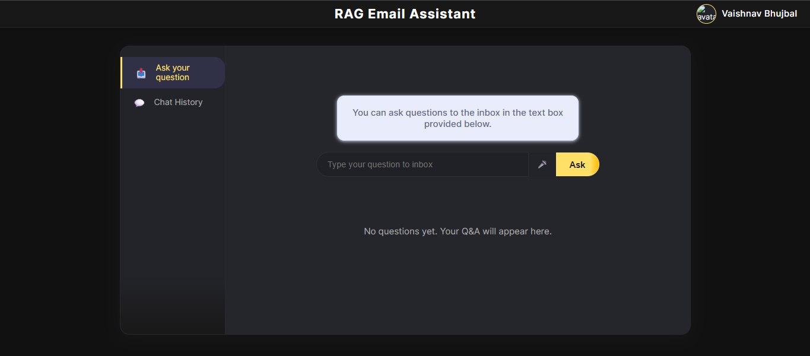
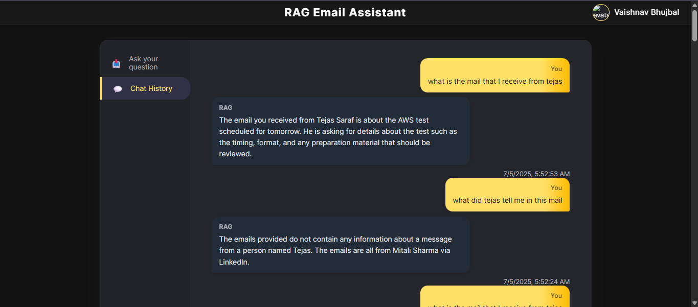

# RAG-Email-Assistant

An AI-powered email assistant that uses Retrieval-Augmented Generation (RAG) to help you intelligently search and analyze your emails. Ask questions about your emails in natural language and get smart, context-aware answers.

## Backend
Backend is used for an AI-powered email assistant using Retrieval-Augmented Generation (RAG) to process and analyze emails.

## Features

- **Gmail Integration**: Secure OAuth2 connection to fetch user emails
- **Semantic Search**: FAISS vector search for email retrieval
- **AI Processing**: GPT-4 powered question answering
- **Conversation History**: MongoDB storage for chat history
- **REST API**: FastAPI endpoints for frontend communication


## Tech Stack
- Backend: Python, FastAPI, OpenAI GPT-4,OpenAI embedding, FAISS, MongoDB, Google APIs
- Frontend: React, JavaScript, Web Speech API, CSS


### Clone the repo
```bash
    git clone https://github.com/vaishnavbhujbal/RAG-Email-Assistant.git
```
```bash
    cd rag-email-assistant
```

## Create  and activate virtual environment
```bash
    python -m venv venv
    source venv/bin/activate  # Linux/Mac
    venv\Scripts\activate   # Windows
```

## Backend Setup
```bash
    cd backend
```

## Install Dependencies
```bash
    pip install -r requirements.txt
```

## Configure Environment Variables
```bash
OPENAI_API_KEY=your_openai_key
GOOGLE_CLIENT_ID=your_client_id.apps.googleusercontent.com
GOOGLE_CLIENT_SECRET=your_secret
MONGO_URL=mongodb://localhost:27017
GOOGLE_CREDENTIALS_FILE=credentials.json
GOOGLE_TOKEN_FILE=token.pickle
```

## Fetch Emails and Build the Index
```bash
    cd app
```
### Run the following scripts in order to fetch your emails, create metadata, and build the FAISS index for semantic search.

By running the below commands you will get the files
1) emails.json
2) emails.index
3) email_metadata.json


```bash
    python fetch_and_update_emails.py
```

```bash
    python update_faiss_index.py 
```

```bash
    python semantic_rag_openai.py   
```

## Start the Backend Server
```bash
    python uvicorn main:app --reload
```


# Frontend Setup

 




Can chat with the RAG to get the information about the mails by asking it questions also the voice input feature is also applied so that you can ask your question without typing and can get relevent answers and secure Google authentication.

## Features

- **Secure Authentication** - Google OAuth login
- **Voice Input** - Speak your questions using Web Speech API
- **Smart Responses** - RAG-powered email question answering
- **Chat History** - View past conversations


## Installation

## Navigating to the frontend directory
```bash
    cd frontend
```


## Install the npm packages
```bash 
    npm install
    # or
    yarn install
```
## Configure Environment Variables
```
    REACT_APP_GOOGLE_CLIENT_ID= your google client ID 
```

## Run the React Application
```bash
    npm start
    # or
    yarn start
```

- Your frontend application will now be running and accessible at http://localhost:3000.